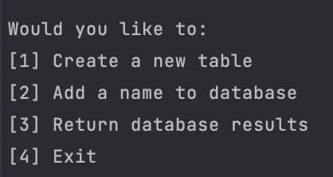

# Console Database Application

> A console application that creates a new local SQLite database and allows the user to interact with the database through the console



## Installation

Windows:

```sh
* Download zip file

* Unzip .zip file to desktop and navigate into the extracted folder

* Open command line and execute the associated .dll file using "./Console-Database.dll"

* To build the solution open the .csproj file and build solution and navigatae to bin/(debug or release)/.net6.0/

* Open ConsoleDatabase.exe
```

Mac:

```sh
* Download zip file

* Unzip .zip file to desktop and navigate into the extracted folder

* To build the solution open the .csproj file and build solution and navigatae to bin/(debug or release)/.net6.0/

* Open ConsoleDatabase
```

## Release History

* 0.0.1
    * Initial Commit - Version 1

## Contributing

1. Fork it
2. Create your feature branch
3. Commit your changes
4. Push to the branch 
5. Create a new Pull Request
